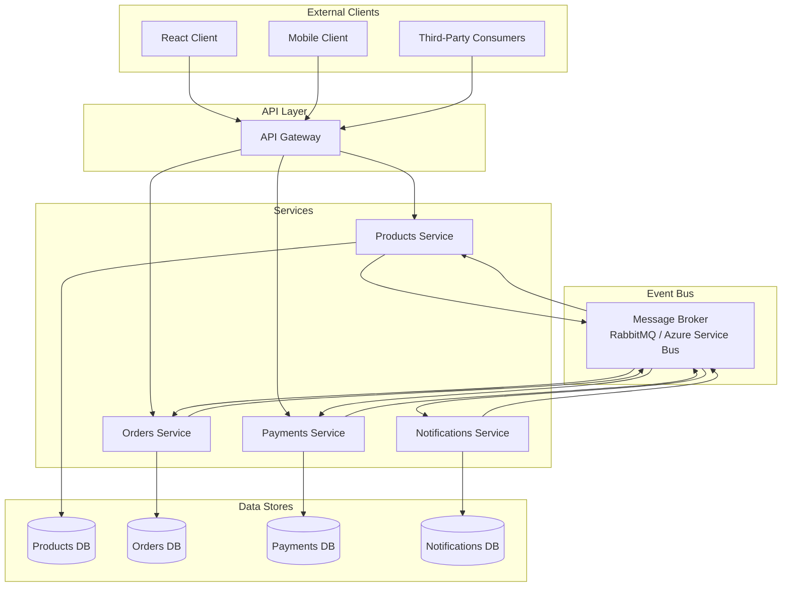
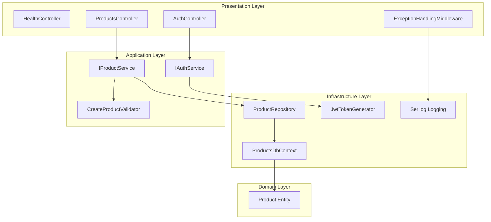

# Architecture Overview

This document describes how the Products service fits within a broader microservices event-driven architecture alongside Orders, Payments, and Notifications services.

## System Architecture

## Design Principles

- **API Gateway**: Single entry point for all external clients. Handles authentication, rate limiting, and request routing to downstream services.
- **Event Bus**: Asynchronous communication between services via a message broker. Services publish domain events (e.g. `ProductCreated`, `OrderPlaced`) and subscribe to events from other services without direct coupling.
- **Database-per-Service**: Each service owns its data store. No shared databases. This ensures loose coupling and allows each service to choose the storage technology best suited to its workload.
- **Independent Deployment**: Each service is developed, tested, and deployed independently.

## Service Responsibilities

| Service | Responsibility | Data Store |
|---------|---------------|------------|
| Products | Product catalogue management (CRUD, filtering) | Products DB (SQL Server / In-Memory) |
| Orders | Order lifecycle management | Orders DB |
| Payments | Payment processing and reconciliation | Payments DB |
| Notifications | Email, SMS, and push notifications | Notifications DB |

## Communication Patterns

- **Synchronous (REST)**: Client-to-service communication via the API Gateway for request/response interactions.
- **Asynchronous (Events)**: Service-to-service communication via the Event Bus for decoupled, eventually consistent workflows.

### Example Event Flow

1. Products Service publishes `ProductCreated` event to the Event Bus.
2. Orders Service subscribes to product events to keep its local product cache up to date.
3. Notifications Service subscribes to order events to send confirmation emails.

## Products Service Internal Architecture

The Products Service follows Clean Architecture with four layers:

- **Presentation**: ASP.NET Core controllers and middleware.
- **Application**: Service interfaces, DTOs, and validation logic.
- **Domain**: Core entities and business rules (no external dependencies).
- **Infrastructure**: EF Core data access, JWT token generation, and logging.
